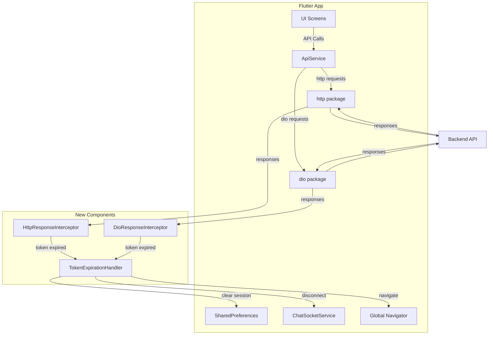
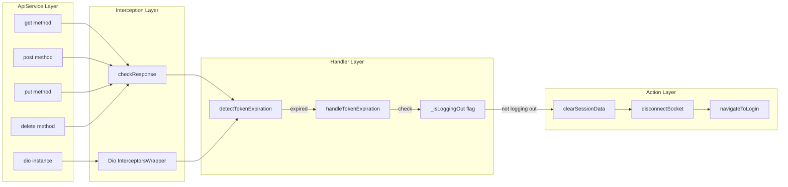
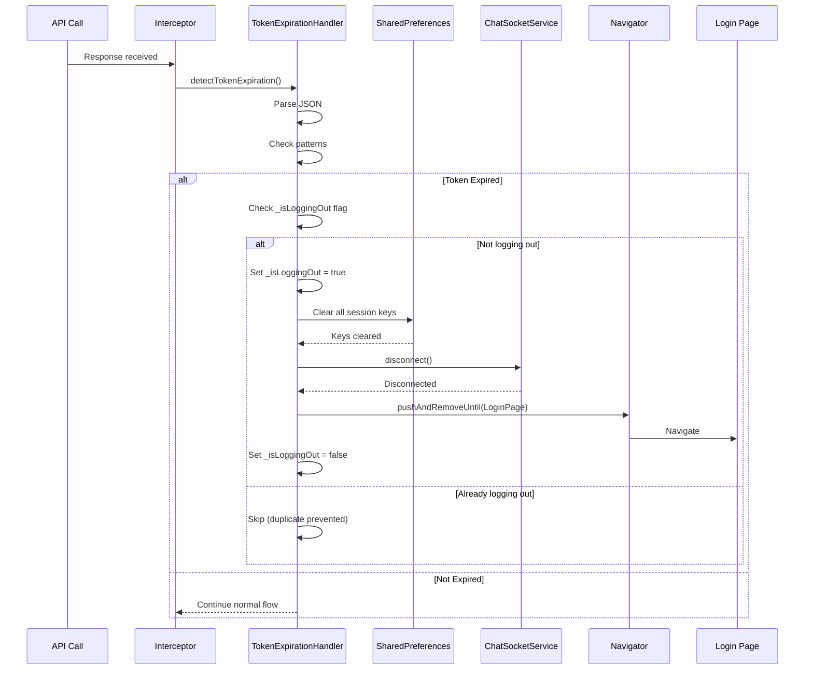

# Technical Design Document: Global Token Expiration Handler

## Overview

The Global Token Expiration Handler provides centralized, automatic detection and handling of authentication token expiration across all API calls in the SchoolSync Flutter application. This feature eliminates the need for manual token expiration checks in each API endpoint method by implementing HTTP response interceptors for both the `http` package and `dio` package used by the ApiService.

### Problem Statement

Currently, the ApiService only handles 403 "Organization Deactivated" errors. When the backend returns a token expiration response (`{"error":"Invalid or expired token","showLoginpage":true}`), there is no centralized mechanism to:
- Detect the expired token across all API calls
- Automatically clear user session data from SharedPreferences
- Disconnect the ChatSocketService
- Navigate the user back to the login page
- Prevent duplicate navigation when multiple simultaneous API calls fail

This creates maintenance overhead, potential security gaps, and inconsistent user experience when tokens expire.

### Solution Approach

Implement response interceptors at the ApiService layer that:
1. Intercept all HTTP responses before they reach calling code
2. Detect token expiration patterns in response bodies
3. Clear all session data from SharedPreferences
4. Disconnect the ChatSocketService
5. Navigate to the login page using the global navigator key
6. Prevent duplicate logout actions through a flag-based guard mechanism
7. Preserve existing 403 deactivated account handling

### Key Design Decisions

1. **Dual Interceptor Pattern**: Implement separate interceptors for `http` package and `dio` package since they have different interception mechanisms
2. **Response Body Parsing**: Parse JSON response bodies to detect token expiration patterns rather than relying solely on HTTP status codes
3. **Global Navigator Key**: Use the existing `navigatorKey` from `notification_router.dart` to enable navigation from any context
4. **Logout Guard Flag**: Use a static boolean flag to prevent duplicate logout actions when multiple API calls fail simultaneously
5. **Preserve Existing Behavior**: Maintain the current 403 deactivated account handling by checking for deactivation errors before token expiration errors
6. **Logging Strategy**: Use Flutter's `debugPrint` for development logging without exposing sensitive token values

## Architecture

### System Context



### Component Architecture



## Components and Interfaces

### 1. TokenExpirationHandler

**Purpose**: Centralized handler for detecting and processing token expiration responses.

**Location**: `lib/core/services/token_expiration_handler.dart`

**Responsibilities**:
- Detect token expiration patterns in response bodies
- Coordinate logout sequence (clear session, disconnect socket, navigate)
- Prevent duplicate logout actions
- Log token expiration events

**Interface**:

```dart
class TokenExpirationHandler {
  // Singleton instance
  static final TokenExpirationHandler _instance = TokenExpirationHandler._internal();
  factory TokenExpirationHandler() => _instance;
  TokenExpirationHandler._internal();
  
  // Guard flag to prevent duplicate logout
  static bool _isLoggingOut = false;
  
  /// Detects if a response body indicates token expiration
  /// Returns true if response contains token expiration indicators
  static bool detectTokenExpiration(String responseBody);
  
  /// Handles the complete token expiration flow
  /// - Checks guard flag
  /// - Clears session data
  /// - Disconnects socket
  /// - Navigates to login
  static Future<void> handleTokenExpiration(String endpoint);
  
  /// Clears all session data from SharedPreferences
  static Future<void> _clearSessionData();
  
  /// Disconnects the ChatSocketService
  static void _disconnectSocket();
  
  /// Navigates to login page and removes all routes
  static void _navigateToLogin();
  
  /// Resets the logout guard flag (for testing)
  static void resetLogoutFlag();
}
```

**Detection Logic**:

```dart
static bool detectTokenExpiration(String responseBody) {
  try {
    final json = jsonDecode(responseBody);
    if (json is! Map<String, dynamic>) return false;
    
    // Check for token expiration indicators
    final hasExpiredError = json['error']?.toString().contains('Invalid or expired token') ?? false;
    final hasShowLoginPage = json['showLoginpage'] == true;
    
    return hasExpiredError || hasShowLoginPage;
  } catch (e) {
    // Invalid JSON - not a token expiration response
    return false;
  }
}
```

### 2. Modified ApiService

**Purpose**: Integrate token expiration handling into existing HTTP client methods.

**Location**: `lib/core/services/api_service.dart` (modified)

**Changes Required**:

1. **Import TokenExpirationHandler**:
```dart
import 'package:appv1/core/services/token_expiration_handler.dart';
```

2. **Modify checkResponse method** (for http package):
```dart
static void checkResponse(http.Response response) {
  // Check for deactivated account FIRST (preserve existing behavior)
  if (response.statusCode == 403) {
    try {
      final body = jsonDecode(response.body);
      final errorMsg = body['error'] ?? body['message'] ?? '';
      if (errorMsg == 'Organization Deactivated' || errorMsg.toString().contains('Deactivated')) {
        navigatorKey.currentState?.pushAndRemoveUntil(
          MaterialPageRoute(builder: (_) => const DeactivatedAccountScreen()),
          (route) => false,
        );
        return; // Exit early - don't check for token expiration
      }
    } catch (_) {}
  }
  
  // Check for token expiration
  if (TokenExpirationHandler.detectTokenExpiration(response.body)) {
    final endpoint = response.request?.url.toString() ?? 'unknown';
    TokenExpirationHandler.handleTokenExpiration(endpoint);
  }
}
```

3. **Modify Dio interceptor** (onError and onResponse):
```dart
static final Dio _dio = Dio(BaseOptions(
  baseUrl: ApiConstants.apiBaseUrl,
  connectTimeout: const Duration(seconds: 15),
  receiveTimeout: const Duration(seconds: 15),
))..interceptors.add(InterceptorsWrapper(
    onRequest: (options, handler) async {
      final headers = await getHeaders();
      options.headers.addAll(headers);
      return handler.next(options);
    },
    onResponse: (response, handler) {
      // Check for token expiration in successful responses
      final responseBody = response.data?.toString() ?? '';
      if (TokenExpirationHandler.detectTokenExpiration(responseBody)) {
        final endpoint = response.requestOptions.uri.toString();
        TokenExpirationHandler.handleTokenExpiration(endpoint);
      }
      return handler.next(response);
    },
    onError: (DioError e, handler) {
      // Check for deactivated account FIRST (preserve existing behavior)
      if (e.response?.statusCode == 403) {
        final data = e.response?.data;
        final errorMsg = (data is Map) ? (data['error'] ?? data['message'] ?? '') : '';
        if (errorMsg == 'Organization Deactivated' || errorMsg.toString().contains('Deactivated')) {
          navigatorKey.currentState?.pushAndRemoveUntil(
            MaterialPageRoute(builder: (_) => const DeactivatedAccountScreen()),
            (route) => false,
          );
          return handler.next(e);
        }
      }
      
      // Check for token expiration in error responses
      final responseBody = e.response?.data?.toString() ?? '';
      if (TokenExpirationHandler.detectTokenExpiration(responseBody)) {
        final endpoint = e.requestOptions.uri.toString();
        TokenExpirationHandler.handleTokenExpiration(endpoint);
      }
      
      return handler.next(e);
    },
  ));
```

### 3. Integration Points

**SharedPreferences Keys to Clear**:
- `authToken` - JWT authentication token
- `isLoggedIn` - Login status flag
- `userRole` - User role (admin/teacher/student)
- `userId` - Generic user ID
- `teacherId` - Teacher-specific ID
- `studentId` - Student-specific ID
- `orgId` - Organization ID
- `classId` - Class ID
- `userEmail` - User email address
- `teacherName` - Teacher name
- `studentName` - Student name
- `userOrg` - Organization name
- `adminEmail` - Admin email
- `teacherCount` - Teacher count
- `nonTeachingCount` - Non-teaching staff count
- `teacherVerified` - Teacher verification status

**ChatSocketService Integration**:
```dart
// In TokenExpirationHandler._disconnectSocket()
final socketService = ChatSocketService();
if (socketService.socket?.connected ?? false) {
  socketService.disconnect();
  debugPrint('[TokenExpiration] ChatSocket disconnected');
}
```

**Navigation Integration**:
```dart
// In TokenExpirationHandler._navigateToLogin()
import 'package:appv1/features/main_app/pages/notification_router.dart';
import 'package:appv1/features/main_app/pages/login_page.dart';

navigatorKey.currentState?.pushAndRemoveUntil(
  MaterialPageRoute(builder: (_) => LoginPage()),
  (route) => false,
);
```

## Data Models

### Token Expiration Response Patterns

The backend can return token expiration in multiple formats:

**Pattern 1: Full format**
```json
{
  "error": "Invalid or expired token",
  "showLoginpage": true
}
```

**Pattern 2: Error only**
```json
{
  "error": "Invalid or expired token"
}
```

**Pattern 3: Flag only**
```json
{
  "showLoginpage": true
}
```

**Pattern 4: Mixed with other data**
```json
{
  "success": false,
  "error": "Invalid or expired token",
  "showLoginpage": true,
  "data": null
}
```

### Session Data Model

```dart
class SessionData {
  // Authentication
  final String? authToken;
  final bool isLoggedIn;
  final String? userRole;
  
  // User Identifiers
  final String? userId;
  final String? teacherId;
  final String? studentId;
  final String? orgId;
  final String? classId;
  
  // User Information
  final String? userEmail;
  final String? teacherName;
  final String? studentName;
  final String? userOrg;
  final String? adminEmail;
  
  // Organization Data
  final int? teacherCount;
  final int? nonTeachingCount;
  
  // Status Flags
  final bool? teacherVerified;
}
```

## Correctness Properties

*A property is a characteristic or behavior that should hold true across all valid executions of a system—essentially, a formal statement about what the system should do. Properties serve as the bridge between human-readable specifications and machine-verifiable correctness guarantees.*

### Property 1: Token Expiration Detection Completeness

*For any* API response containing either `"error":"Invalid or expired token"` OR `"showLoginpage":true`, the TokenExpirationHandler SHALL detect it as a token expiration response regardless of other fields present in the JSON.

**Validates: Requirements 1.1, 1.2, 1.3, 2.1, 2.2, 2.3, 8.1, 8.2, 8.3, 8.5**

### Property 2: Invalid JSON Rejection

*For any* response body that is not valid JSON, the TokenExpirationHandler SHALL NOT trigger token expiration handling and SHALL return false from detectTokenExpiration.

**Validates: Requirements 1.4, 2.4**

### Property 3: Non-Expiration Error Rejection

*For any* API response containing error messages that do not match the token expiration patterns, the TokenExpirationHandler SHALL NOT trigger token expiration handling.

**Validates: Requirements 1.5, 2.5**

### Property 4: Session Data Clearing Completeness

*For any* token expiration event, the TokenExpirationHandler SHALL remove all session-related keys from SharedPreferences, including authToken, isLoggedIn, userRole, and all role-specific identifiers.

**Validates: Requirements 3.1, 3.2, 3.3, 3.4, 3.5**

### Property 5: Logout Idempotence

*For any* sequence of multiple simultaneous API calls that all detect token expiration, the TokenExpirationHandler SHALL execute the logout flow exactly once, preventing duplicate session clearing and navigation actions.

**Validates: Requirements 4.5, 10.3**

### Property 6: Navigation Stack Clearing

*For any* token expiration event that triggers navigation, the TokenExpirationHandler SHALL remove all previous routes from the navigation stack, ensuring the login page becomes the root route.

**Validates: Requirements 4.2**

### Property 7: Deactivation Priority

*For any* API response with status code 403 containing "Organization Deactivated" or "Deactivated" in the error message, the ApiService SHALL navigate to the Deactivated Account Screen and SHALL NOT trigger token expiration handling.

**Validates: Requirements 5.1, 5.2, 5.3, 5.4, 5.5**

### Property 8: Socket Disconnection Safety

*For any* token expiration event, the TokenExpirationHandler SHALL attempt to disconnect the ChatSocketService, and if the socket is not connected, SHALL proceed with the logout flow without errors.

**Validates: Requirements 7.3**

### Property 9: Backward Compatibility

*For any* existing ApiService method call (get, post, put, delete, dio), the token expiration handler SHALL intercept responses automatically without requiring changes to the method signatures or calling code.

**Validates: Requirements 6.1, 6.2, 6.3, 6.4, 6.5, 6.6**

### Property 10: Logging Without Sensitive Data

*For any* token expiration event that is logged, the log message SHALL include the endpoint URL and timestamp but SHALL NOT include the actual token value or password data.

**Validates: Requirements 9.1, 9.2, 9.3, 9.4, 9.5**

## Error Handling

### Error Scenarios and Responses

| Scenario | Detection | Handling | User Impact |
|----------|-----------|----------|-------------|
| Valid token expiration response | Detected by pattern matching | Full logout flow executed | Redirected to login |
| Malformed JSON response | Not detected (returns false) | No action taken | Original error handling applies |
| Network timeout | Not detected | No action taken | Original error handling applies |
| 403 Deactivated account | Detected by status code + message | Navigate to deactivated screen | Shown deactivation message |
| SharedPreferences clear failure | Logged but not blocking | Continue with navigation | User still logged out |
| ChatSocket disconnect failure | Logged but not blocking | Continue with navigation | Socket cleaned up on next connect |
| Navigator key null | Logged as error | Logout flow incomplete | User may need to restart app |
| Multiple simultaneous expirations | First detected | Guard flag prevents duplicates | Single logout flow |
| Background request expiration | Detected | Session cleared immediately | Login shown on foreground return |

### Error Recovery Strategies

1. **SharedPreferences Failure**:
   - Log the error with `debugPrint`
   - Continue with socket disconnection and navigation
   - User will see login page even if some keys remain

2. **Navigation Failure**:
   - Log the error with `debugPrint`
   - Session data is already cleared
   - User will see login page on next app launch

3. **Socket Disconnection Failure**:
   - Log the error with `debugPrint`
   - Continue with navigation
   - Socket will be cleaned up on next connection attempt

4. **JSON Parsing Failure**:
   - Return false from detectTokenExpiration
   - Allow original error handling to proceed
   - No logout triggered for malformed responses

### Logging Strategy

```dart
// Success logging
debugPrint('[TokenExpiration] Detected at ${DateTime.now()} for endpoint: $endpoint');
debugPrint('[TokenExpiration] Session data cleared');
debugPrint('[TokenExpiration] ChatSocket disconnected');
debugPrint('[TokenExpiration] Navigating to login page');

// Error logging
debugPrint('[TokenExpiration] ERROR: Failed to clear session data: $error');
debugPrint('[TokenExpiration] ERROR: Failed to disconnect socket: $error');
debugPrint('[TokenExpiration] ERROR: Navigator key is null, cannot navigate');
debugPrint('[TokenExpiration] ERROR: Duplicate logout attempt prevented');

// Never log sensitive data
// ❌ BAD: debugPrint('Token: $authToken');
// ✅ GOOD: debugPrint('Token cleared from SharedPreferences');
```

## Testing Strategy

### Unit Testing

**Test File**: `test/core/services/token_expiration_handler_test.dart`

**Test Categories**:

1. **Detection Tests** (Example-based):
   - Test detection with full format response
   - Test detection with error-only format
   - Test detection with flag-only format
   - Test rejection of invalid JSON
   - Test rejection of non-expiration errors
   - Test rejection of empty response
   - Test case-sensitive matching

2. **Session Clearing Tests** (Example-based):
   - Test all session keys are removed
   - Test clearing with missing keys doesn't error
   - Test clearing with SharedPreferences failure

3. **Guard Flag Tests** (Example-based):
   - Test first call proceeds
   - Test second simultaneous call is blocked
   - Test flag reset after completion

4. **Integration Tests** (Example-based):
   - Test http package interception
   - Test dio package interception
   - Test deactivation takes priority over expiration
   - Test navigation to login page
   - Test socket disconnection

### Property-Based Testing

**Assessment**: Property-based testing is **NOT appropriate** for this feature because:

1. **External Service Integration**: The feature primarily tests integration with SharedPreferences, ChatSocketService, and Navigator - all external Flutter services with side effects
2. **UI Navigation**: Navigation behavior cannot be meaningfully tested with property-based approaches
3. **State Management**: The logout guard flag is a one-time state change, not a pure function
4. **Mock-Heavy Testing**: Testing would require extensive mocking of Flutter framework components, which defeats the purpose of PBT

**Alternative Testing Approach**:
- **Unit tests** with mocks for SharedPreferences, ChatSocketService, and Navigator
- **Widget tests** for navigation behavior
- **Integration tests** with test doubles for backend responses

### Test Configuration

```yaml
# pubspec.yaml
dev_dependencies:
  flutter_test:
    sdk: flutter
  mockito: ^5.4.0
  build_runner: ^2.4.0
```

### Example Test Cases

```dart
group('TokenExpirationHandler.detectTokenExpiration', () {
  test('detects full format with error and showLoginpage', () {
    final response = '{"error":"Invalid or expired token","showLoginpage":true}';
    expect(TokenExpirationHandler.detectTokenExpiration(response), true);
  });
  
  test('detects error-only format', () {
    final response = '{"error":"Invalid or expired token"}';
    expect(TokenExpirationHandler.detectTokenExpiration(response), true);
  });
  
  test('detects flag-only format', () {
    final response = '{"showLoginpage":true}';
    expect(TokenExpirationHandler.detectTokenExpiration(response), true);
  });
  
  test('rejects invalid JSON', () {
    final response = 'not json at all';
    expect(TokenExpirationHandler.detectTokenExpiration(response), false);
  });
  
  test('rejects different error messages', () {
    final response = '{"error":"Network timeout"}';
    expect(TokenExpirationHandler.detectTokenExpiration(response), false);
  });
  
  test('rejects empty response', () {
    final response = '';
    expect(TokenExpirationHandler.detectTokenExpiration(response), false);
  });
});

group('TokenExpirationHandler.handleTokenExpiration', () {
  late MockSharedPreferences mockPrefs;
  late MockChatSocketService mockSocket;
  late MockNavigatorState mockNavigator;
  
  setUp(() {
    mockPrefs = MockSharedPreferences();
    mockSocket = MockChatSocketService();
    mockNavigator = MockNavigatorState();
    TokenExpirationHandler.resetLogoutFlag();
  });
  
  test('clears all session keys', () async {
    when(mockPrefs.remove(any)).thenAnswer((_) async => true);
    
    await TokenExpirationHandler.handleTokenExpiration('test-endpoint');
    
    verify(mockPrefs.remove('authToken')).called(1);
    verify(mockPrefs.remove('isLoggedIn')).called(1);
    verify(mockPrefs.remove('userRole')).called(1);
    // ... verify all other keys
  });
  
  test('prevents duplicate logout', () async {
    when(mockPrefs.remove(any)).thenAnswer((_) async => true);
    
    // First call should proceed
    await TokenExpirationHandler.handleTokenExpiration('endpoint1');
    
    // Second call should be blocked
    await TokenExpirationHandler.handleTokenExpiration('endpoint2');
    
    // Verify session clearing only happened once
    verify(mockPrefs.remove('authToken')).called(1);
  });
  
  test('disconnects socket if connected', () async {
    when(mockSocket.socket?.connected).thenReturn(true);
    
    await TokenExpirationHandler.handleTokenExpiration('test-endpoint');
    
    verify(mockSocket.disconnect()).called(1);
  });
  
  test('handles socket not connected gracefully', () async {
    when(mockSocket.socket?.connected).thenReturn(false);
    
    // Should not throw
    await TokenExpirationHandler.handleTokenExpiration('test-endpoint');
    
    verify(mockSocket.disconnect()).called(0);
  });
});

group('ApiService.checkResponse', () {
  test('prioritizes deactivation over token expiration', () {
    final response = http.Response(
      '{"error":"Organization Deactivated","showLoginpage":true}',
      403,
    );
    
    ApiService.checkResponse(response);
    
    // Should navigate to deactivated screen, not login
    // Verify navigation mock
  });
  
  test('handles token expiration after deactivation check', () {
    final response = http.Response(
      '{"error":"Invalid or expired token","showLoginpage":true}',
      401,
    );
    
    ApiService.checkResponse(response);
    
    // Should navigate to login page
    // Verify navigation mock
  });
});
```

### Manual Testing Checklist

- [ ] Admin login with expired token redirects to login
- [ ] Teacher login with expired token redirects to login
- [ ] Student login with expired token redirects to login
- [ ] Multiple simultaneous API calls with expired token only logout once
- [ ] ChatSocket disconnects on token expiration
- [ ] All SharedPreferences keys are cleared
- [ ] Navigation stack is cleared (back button doesn't work)
- [ ] 403 deactivated account still shows deactivation screen
- [ ] Background API call expiration shows login on foreground return
- [ ] Logs show endpoint and timestamp but not token values

## Implementation Plan

### Phase 1: Core Handler Implementation
1. Create `TokenExpirationHandler` class
2. Implement `detectTokenExpiration` method
3. Implement `_clearSessionData` method
4. Implement `_disconnectSocket` method
5. Implement `_navigateToLogin` method
6. Implement `handleTokenExpiration` with guard flag
7. Write unit tests for handler

### Phase 2: ApiService Integration
1. Modify `checkResponse` method for http package
2. Modify Dio interceptor for onResponse
3. Modify Dio interceptor for onError
4. Ensure deactivation check happens first
5. Write integration tests

### Phase 3: Testing and Validation
1. Run unit tests
2. Run integration tests
3. Manual testing across all user roles
4. Test multiple simultaneous API calls
5. Test background request scenarios
6. Verify logging output

### Phase 4: Documentation and Deployment
1. Update API service documentation
2. Add inline code comments
3. Create developer guide for token expiration handling
4. Deploy to staging environment
5. Monitor logs for token expiration events
6. Deploy to production

## Dependencies

### Existing Dependencies
- `shared_preferences: ^2.3.2` - Session data storage
- `http: ^1.2.2` - HTTP client for REST API calls
- `dio: 5.0.0` - Advanced HTTP client with interceptors
- `socket_io_client: ^2.0.3+1` - Real-time chat socket
- `flutter/material.dart` - Navigation and UI framework

### No New Dependencies Required
All functionality can be implemented using existing dependencies.

## Performance Considerations

### Response Interception Overhead
- **JSON Parsing**: Each response is parsed once to check for token expiration
- **Impact**: Minimal (~1-2ms per response)
- **Mitigation**: Early return for non-JSON responses

### Session Clearing Performance
- **SharedPreferences Operations**: Multiple remove operations in sequence
- **Impact**: ~10-50ms total for all keys
- **Mitigation**: Operations are async and don't block UI

### Navigation Performance
- **Route Clearing**: `pushAndRemoveUntil` clears entire navigation stack
- **Impact**: ~50-100ms depending on stack depth
- **Mitigation**: Acceptable for logout scenario (one-time operation)

### Memory Considerations
- **Guard Flag**: Single static boolean (~1 byte)
- **Singleton Instance**: One instance per app lifecycle
- **Impact**: Negligible memory footprint

## Security Considerations

### Token Exposure
- **Risk**: Token values could be logged or exposed in error messages
- **Mitigation**: Never log actual token values, only log that token was cleared

### Session Data Persistence
- **Risk**: Session data could remain if clearing fails
- **Mitigation**: Continue with navigation even if clearing fails; user will see login page

### Race Conditions
- **Risk**: Multiple simultaneous API calls could trigger duplicate logouts
- **Mitigation**: Guard flag prevents duplicate execution

### Deactivation Bypass
- **Risk**: Token expiration handling could interfere with deactivation flow
- **Mitigation**: Check for deactivation errors before token expiration errors

## Future Enhancements

### Potential Improvements
1. **Token Refresh**: Implement automatic token refresh before expiration
2. **Expiration Warning**: Show warning to user before token expires
3. **Offline Queue**: Queue API calls when token is expired and retry after re-login
4. **Analytics**: Track token expiration frequency and patterns
5. **Custom Error Messages**: Show user-friendly messages based on expiration context

### Extensibility Points
- `TokenExpirationHandler` can be extended to handle other authentication errors
- Detection logic can be updated to support additional backend response formats
- Logout flow can be customized per user role if needed

## Appendix

### Backend API Response Examples

**Successful Response**:
```json
{
  "success": true,
  "data": { ... }
}
```

**Token Expiration Response**:
```json
{
  "error": "Invalid or expired token",
  "showLoginpage": true
}
```

**Deactivated Account Response**:
```json
{
  "error": "Organization Deactivated",
  "statusCode": 403
}
```

### SharedPreferences Keys Reference

| Key | Type | Description | Cleared on Logout |
|-----|------|-------------|-------------------|
| `authToken` | String | JWT authentication token | ✅ |
| `isLoggedIn` | bool | Login status flag | ✅ |
| `userRole` | String | User role (admin/teacher/student) | ✅ |
| `userId` | String | Generic user ID | ✅ |
| `teacherId` | String | Teacher-specific ID | ✅ |
| `studentId` | String | Student-specific ID | ✅ |
| `orgId` | String | Organization ID | ✅ |
| `classId` | String | Class ID | ✅ |
| `userEmail` | String | User email address | ✅ |
| `teacherName` | String | Teacher name | ✅ |
| `studentName` | String | Student name | ✅ |
| `userOrg` | String | Organization name | ✅ |
| `adminEmail` | String | Admin email | ✅ |
| `teacherCount` | int | Teacher count | ✅ |
| `nonTeachingCount` | int | Non-teaching staff count | ✅ |
| `teacherVerified` | bool | Teacher verification status | ✅ |

### Navigation Flow Diagram


